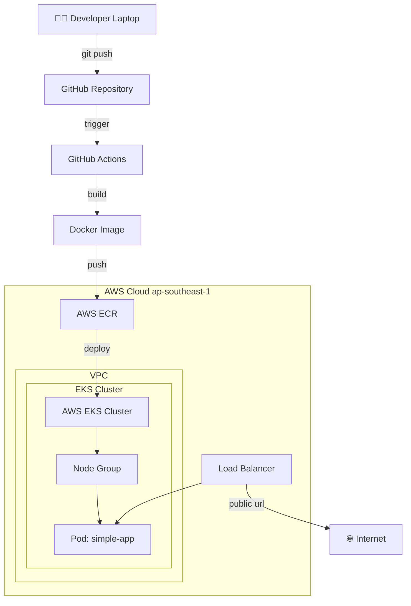

# Architecture Diagram

## Full CI/CD Pipeline

## AWS Services Used

| Service | Purpose |
|---|---|
| EKS | Kubernetes cluster |
| ECR | Container registry |
| VPC | Network isolation |
| Subnet | Network segmentation |
| IGW | Internet access |
| ALB | Load balancing |
| IAM | Access management |

## CI/CD Flow

| Step | Tool | Action |
|---|---|---|
| 1 | Git | Push code |
| 2 | GitHub Actions | Trigger pipeline |
| 3 | Docker | Build image |
| 4 | ECR | Store image |
| 5 | kubectl | Deploy to EKS |
| 6 | EKS | Run containers |

## Tech Stack

| Category | Technology |
|---|---|
| Language | Python (Flask) |
| Container | Docker |
| Orchestration | Kubernetes (EKS) |
| IaC | Terraform |
| CI/CD | GitHub Actions |
| Cloud | AWS |